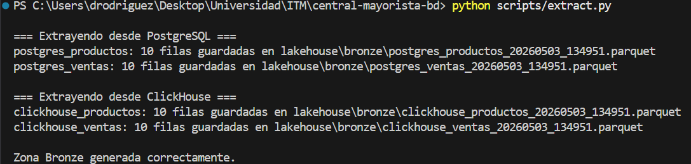
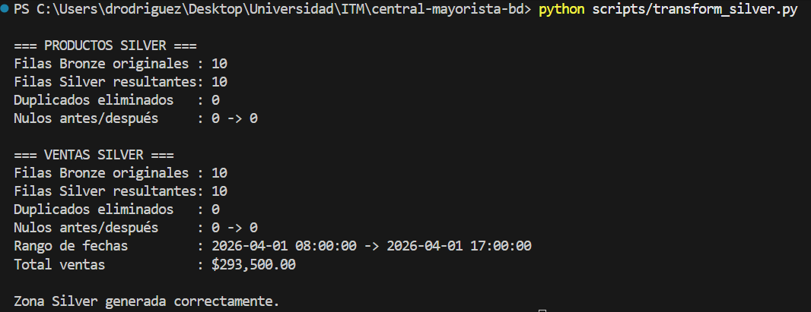
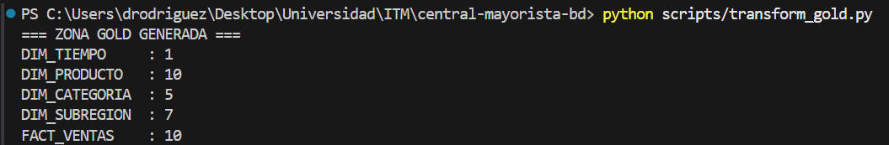
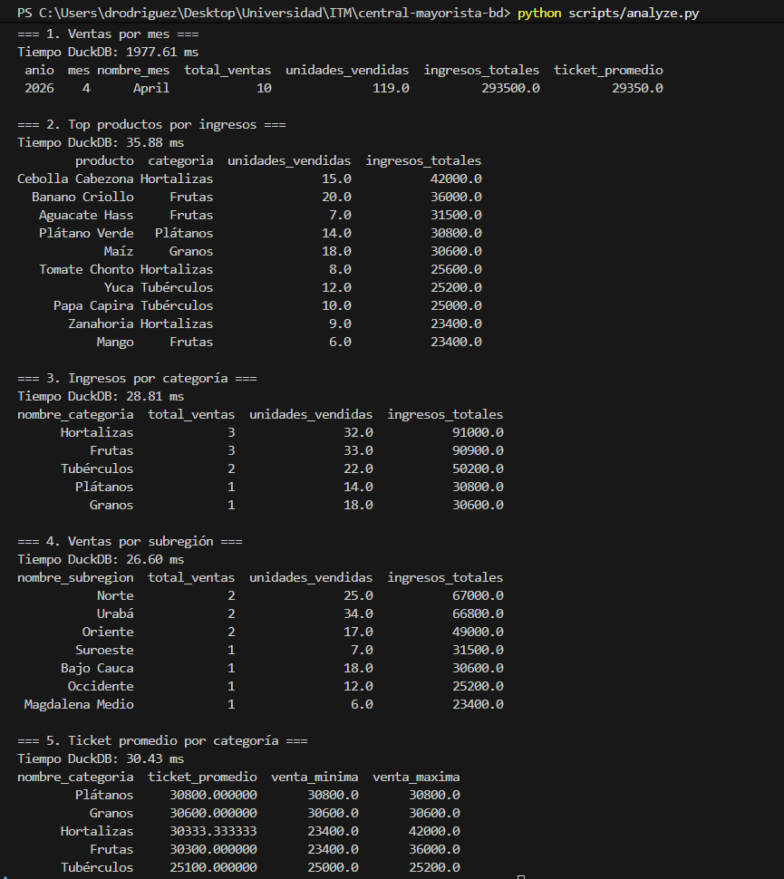
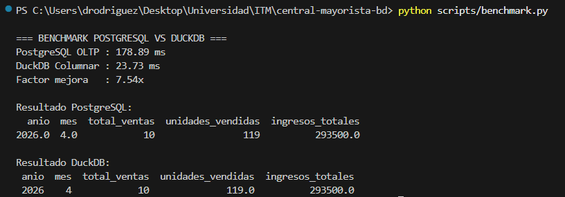

# Paso 1 — Diseño Dimensional (Central Mayorista)

## 1. ¿Cuál es el proceso de negocio que vamos a analizar?

El proceso de negocio seleccionado corresponde al **análisis de ventas de productos comercializados en la Central Mayorista**, enfocándose en el comportamiento comercial por producto, categoría, subregión y periodo de tiempo.

El objetivo es identificar patrones de venta, productos líderes, categorías más rentables y evolución temporal de los ingresos.

---

## 2. ¿Cuál es la granularidad?

La granularidad definida para la tabla de hechos es:

> **Una fila representa una venta individual de un producto realizada en una fecha y hora específica.**

Cada registro contiene el producto vendido, cantidad, precio unitario, valor total y ubicación comercial (subregión).

Esta granularidad permite análisis detallado y agregaciones posteriores por día, mes, categoría o zona.

---

## 3. ¿Cuáles son las dimensiones?

Las dimensiones propuestas para el modelo estrella son:

| Dimensión     | Atributos principales                       | ¿Cambia en el tiempo? |
| ------------- | ------------------------------------------- | --------------------- |
| DIM_TIEMPO    | fecha, año, trimestre, mes, día, día_semana | No (Tipo 0)           |
| DIM_PRODUCTO  | producto_id, nombre, categoría, precio base | Sí (Tipo 2)           |
| DIM_CATEGORIA | categoria_id, nombre_categoria              | Raro (Tipo 1)         |
| DIM_SUBREGION | subregion_id, nombre_subregion              | No (Tipo 0)           |

### Justificación:

* **DIM_TIEMPO** permite análisis históricos.
* **DIM_PRODUCTO** contiene contexto del artículo vendido.
* **DIM_CATEGORIA** agrupa productos por línea comercial.
* **DIM_SUBREGION** permite análisis geográfico/comercial.

---

## 4. ¿Cuáles son las métricas (hechos)?

| Tipo         | Métrica         | Descripción                                  |
| ------------ | --------------- | -------------------------------------------- |
| Aditiva      | cantidad        | Unidades vendidas                            |
| Aditiva      | total_venta     | Valor total de la venta                      |
| Semi-aditiva | stock_actual    | Válido por producto, no por tiempo acumulado |
| No aditiva   | precio_unitario | Se promedia o usa como referencia            |
| No aditiva   | margen_pct      | Indicador porcentual                         |

### Métricas Gold esperadas:

* Top 10 productos más vendidos
* Ingresos por categoría
* Ventas por subregión
* Ticket promedio por venta
* Evolución mensual de ventas
* Participación porcentual por categoría

---

## 5. Estrategia SCD para al menos una dimensión

Se implementará **Slowly Changing Dimension Tipo 2** para `DIM_PRODUCTO`.

Esto permite conservar historial cuando cambien atributos como:

* precio base
* categoría
* nombre comercial

### Ejemplo:

| producto_sk | producto_id | nombre      | precio | válido_desde | válido_hasta | activo |
| ----------- | ----------- | ----------- | ------ | ------------ | ------------ | ------ |
| 1           | 101         | Papa Capira | 1800   | 2026-01-01   | 2026-04-30   | false  |
| 2           | 101         | Papa Capira | 2100   | 2026-05-01   | 9999-12-31   | true   |

Esto permite analizar ventas históricas con el precio vigente en cada momento.

---

# Modelo Estrella Propuesto

### Tabla de Hechos: FACT_VENTAS

| Campo           |
| --------------- |
| venta_id        |
| tiempo_sk       |
| producto_sk     |
| categoria_sk    |
| subregion_sk    |
| cantidad        |
| precio_unitario |
| total_venta     |

---

# Conclusión del Diseño

El modelo dimensional propuesto permite transformar datos operacionales de la Central Mayorista en información analítica útil para toma de decisiones comerciales, inventario y comportamiento regional.

## Diseño Dimensional

El diseño dimensional del proyecto se documenta a partir del proceso de negocio de ventas de productos en la Central Mayorista.

El diagrama del modelo estrella fue generado y almacenado en la carpeta `docs` del proyecto:


## Paso 2 - Zona Bronze
## Evidencia Bronze



## Paso 3 — Limpieza / Zona Silver

La zona Silver fue generada a partir de los archivos Bronze provenientes de PostgreSQL. En esta fase se aplicaron limpiezas técnicas sobre productos y ventas:

- Conversión de tipos numéricos.
- Conversión de fechas.
- Normalización de textos.
- Validación de nulos.
- Eliminación de duplicados.
- Validación de ventas con cantidad, precio y total mayores a cero.

### Resultado del reporte de calidad

| Dataset | Filas Bronze | Filas Silver | Duplicados eliminados | Nulos antes/después |
|---|---:|---:|---:|---:|
| Productos | 10 | 10 | 0 | 0 → 0 |
| Ventas | 10 | 10 | 0 | 0 → 0 |

Rango de fechas de ventas:

```text
2026-04-01 08:00:00 -> 2026-04-01 17:00:00
```



## Paso 4 — Zona Gold

En esta fase se construyó el modelo dimensional del proyecto Central Mayorista usando arquitectura estrella.

### Tablas generadas:

- DIM_TIEMPO
- DIM_PRODUCTO
- DIM_CATEGORIA
- DIM_SUBREGION
- FACT_VENTAS

Los archivos fueron almacenados en formato Parquet dentro de:

```bash
lakehouse/gold/
```



## Paso 5 
# Paso 5.1 — Consultas Analíticas en DuckDB

## Objetivo

En esta fase se desarrollaron consultas analíticas sobre la **Zona Gold** del proyecto Central Mayorista utilizando **DuckDB** como motor analítico columnar.

DuckDB permite leer archivos Parquet directamente sin necesidad de cargar datos en un servidor tradicional, lo que facilita análisis rápidos sobre arquitecturas Lakehouse locales.

---

## Fuente consultada

Los análisis se ejecutaron sobre los archivos ubicados en:

```bash
lakehouse/gold/
```



# Paso 5.2 — Benchmark: Base Operacional vs Motor Columnar

## Objetivo

En esta fase se ejecutó la **misma consulta analítica** sobre dos tecnologías diferentes con el fin de comparar tiempos de respuesta:

- **PostgreSQL** como base de datos operacional (OLTP)
- **DuckDB** como motor columnar sobre archivos Parquet de la Zona Gold

El propósito fue evidenciar diferencias de rendimiento entre una base transaccional tradicional y una arquitectura orientada a analítica.

---

## Consulta evaluada

Se comparó una agregación mensual de ventas:

- total de ventas
- unidades vendidas
- ingresos totales

Agrupando por:

- año
- mes

---

## Tecnologías comparadas

| Motor | Tipo |
|---|---|
| PostgreSQL | OLTP (row-store) |
| DuckDB | OLAP columnar |

---

## Resultados obtenidos

| Motor | Tiempo |
|---|---:|
| PostgreSQL OLTP | 178.89 ms |
| DuckDB Columnar | 23.73 ms |

### Factor de mejora

```text
7.54x
```



# Paso 5.3 — Generación de Datos Sintéticos para Escalabilidad

## Objetivo

Debido a que el dataset original del proyecto Central Mayorista contenía una cantidad reducida de registros, se implementó un proceso de **generación de datos sintéticos** con el fin de simular un escenario más realista y permitir pruebas de rendimiento más representativas.

Esta práctica es común en entornos profesionales cuando se requiere validar arquitecturas analíticas antes de contar con grandes volúmenes reales.

---

## Proceso implementado

## Mejora aplicada — Escalamiento del volumen de datos

Atendiendo la observación del docente, se incrementó el volumen de datos del proyecto mediante la generación de datos sintéticos.

El dataset pasó de aproximadamente 5.810 ventas a:

```bash
scripts/generate_test_data.py
```
```text
105.010 ventas en PostgreSQL
```

# Paso 6 — Pipeline Completo

## Objetivo

Como fase final del laboratorio se integró todo el proceso del Mini-Lakehouse en un único punto de ejecución mediante el archivo:

```bash
main.py
```


# Ejecutar todo con un comando

```bash
python main.py
```

---

# Qué hace

Ejecuta automáticamente:

```text
1. Bronze
2. Silver
3. Gold
4. Consultas analíticas
5. Benchmark
```

# Paso 6 — Pipeline Completo

## Objetivo

Como fase final del laboratorio se integró todo el proceso del Mini-Lakehouse en un único punto de ejecución mediante el archivo:

```bash
main.py
````

Esto permite ejecutar el flujo completo desde la raíz del proyecto con un solo comando.

---

## Ejecución

```bash
python main.py
```

---

## Procesos automatizados

El pipeline ejecuta secuencialmente:

1. Extracción hacia Zona Bronze
2. Limpieza y calidad hacia Zona Silver
3. Construcción dimensional hacia Zona Gold
4. Consultas analíticas en DuckDB
5. Benchmark de rendimiento

---

## Beneficios obtenidos

* Reproducibilidad total del proyecto
* Automatización del flujo de datos
* Facilidad de evaluación académica
* Ejecución estándar tipo industria

---

## Resultado esperado

```text
Pipeline finalizado correctamente
Archivos finales disponibles en lakehouse/gold/
```

---

## Conclusión

El proyecto Central Mayorista quedó implementado como una arquitectura Lakehouse funcional de extremo a extremo, ejecutable mediante un solo comando.

```
