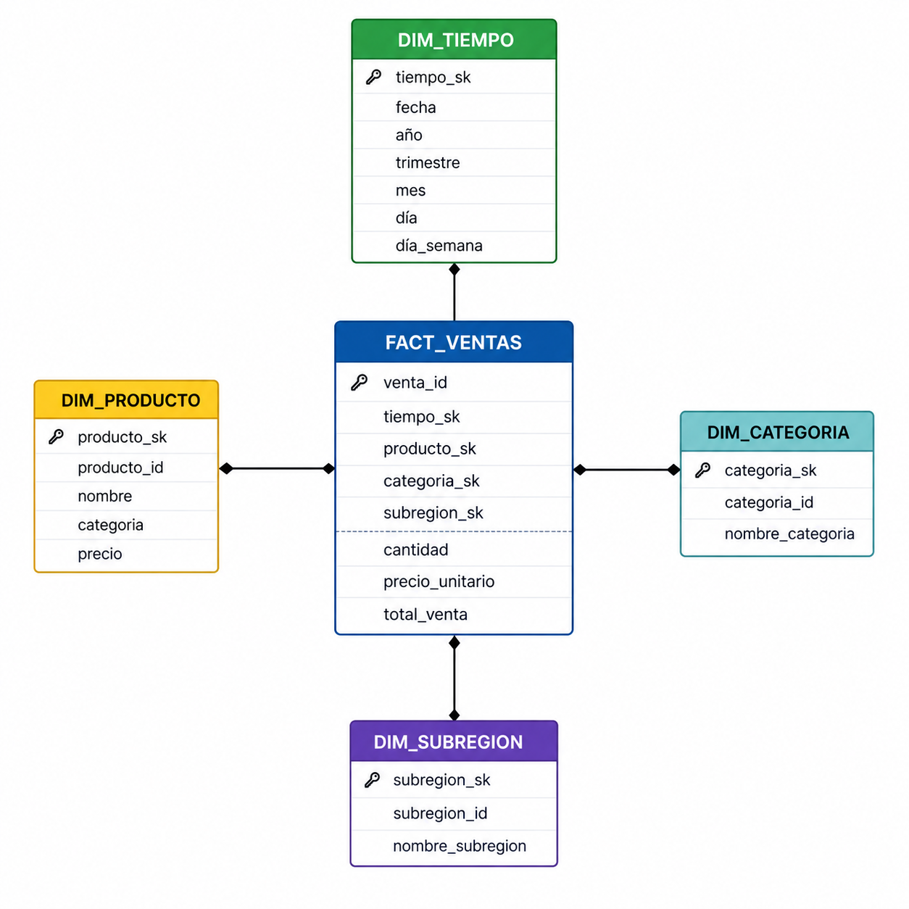

# Central Mayorista — Mini-Lakehouse

## Descripción

Este proyecto implementa una arquitectura **Mini-Lakehouse** aplicada al dominio de la **Central Mayorista**, enfocada en el análisis de ventas de productos agrícolas y de abastecimiento.

El proceso de negocio analizado corresponde a las **ventas por producto, categoría, subregión y periodo de tiempo**, permitiendo generar indicadores comerciales relevantes como:

- Top productos más vendidos  
- Ingresos por categoría  
- Ventas por subregión  
- Ticket promedio  
- Evolución mensual de ventas  
- Benchmark de rendimiento entre motores de datos  

El objetivo académico fue demostrar cómo transformar una base operacional tradicional en una arquitectura analítica moderna utilizando herramientas open source.

---

## Arquitectura



### Componentes utilizados

| Componente | Tecnología |
|---|---|
| Base operacional (OLTP) | PostgreSQL |
| Motor analítico previo | ClickHouse |
| Lakehouse Storage | Parquet |
| Motor analítico columnar | DuckDB |
| Lenguaje ETL | Python |
| Orquestación | main.py |

---

## Flujo del proyecto

```text
PostgreSQL / ClickHouse
        ↓
   Zona Bronze
(raw data Parquet)
        ↓
   Zona Silver
(clean data)
        ↓
    Zona Gold
(modelo estrella)
        ↓
DuckDB Analytics
````

---

## Zonas Lakehouse

| Zona   | Descripción                                          |
| ------ | ---------------------------------------------------- |
| Bronze | Datos crudos extraídos desde PostgreSQL y ClickHouse |
| Silver | Datos limpios, tipados y sin duplicados              |
| Gold   | Modelo dimensional listo para analítica              |

---

## Requisitos

* Python 3.10+
* PostgreSQL activo
* ClickHouse activo
* pip

Instalar dependencias:

```bash
pip install -r requirements.txt
```

---

## Estructura del Proyecto

```bash
central-mayorista-bd/
│── docs/
│── lakehouse/
│   ├── bronze/
│   ├── silver/
│   └── gold/
│── scripts/
│   ├── extract.py
│   ├── transform_silver.py
│   ├── transform_gold.py
│   ├── analyze.py
│   ├── benchmark.py
│   └── generate_test_data.py
│── main.py
│── requirements.txt
│── docker-compose.yml
│── README.md
```

---

## Levantar servicios con Docker

Antes de ejecutar el pipeline, el usuario debe construir y levantar los servicios definidos en `docker-compose.yml`.

El proyecto utiliza Docker Compose para crear las bases de datos necesarias:

- PostgreSQL como fuente operacional.
- ClickHouse como motor analítico previo.

### Construir y levantar contenedores

```bash
docker compose up -d --build
```


## Ejecutar el pipeline completo

```bash
git clone https://github.com/danielrodriguezc04/central-mayorista-bd
cd central-mayorista-bd
pip install -r requirements.txt
python main.py
```

---

## Resultado del Pipeline

```text
Pipeline finalizado correctamente
Archivos disponibles en lakehouse/gold/
Tiempo total aproximado: 15.96 segundos
```

---

## Modelo Dimensional

### Tabla de Hechos

**FACT_VENTAS**

* venta_id
* tiempo_sk
* producto_sk
* categoria_sk
* subregion_sk
* cantidad
* precio_unitario
* total_venta

### Dimensiones

* DIM_TIEMPO
* DIM_PRODUCTO
* DIM_CATEGORIA
* DIM_SUBREGION

---

## Resultados Analíticos

### Ventas por Mes

| Año  | Mes | Ventas |     Ingresos |
| ---- | --: | -----: | -----------: |
| 2026 |   1 |   1274 | $139,543,300 |
| 2026 |   2 |   1152 | $126,367,000 |
| 2026 |   3 |   1266 | $140,700,900 |
| 2026 |   4 |   1276 | $137,675,800 |
| 2026 |   5 |     42 |   $4,546,500 |

---

### Top Productos

| Producto      |    Ingresos |
| ------------- | ----------: |
| Aguacate Hass | $93,771,000 |
| Mango         | $73,343,400 |
| Tomate Chonto | $64,464,000 |
| Zanahoria     | $54,836,600 |

---

### Categoría Líder

```text
Frutas → $205,362,600
```

---

## Resultados del Benchmark

| Motor             | Query          |   Tiempo |
| ----------------- | -------------- | -------: |
| PostgreSQL (OLTP) | Ventas por mes | 81.29 ms |
| DuckDB (Columnar) | Ventas por mes | 11.98 ms |

### Factor de mejora

```text
DuckDB fue 6.79x más rápido que PostgreSQL
```

---

## Generación de Datos Sintéticos

Para robustecer el benchmark, se generaron:

```text
5000 ventas adicionales
```

Mediante:

```bash
python scripts/generate_test_data.py
```

---

# Optimización Analítica (Taller 4)

Se analizaron tres consultas analíticas mediante `EXPLAIN ANALYZE`:

- Q1: Ventas por mes
- Q2: Top productos por ingresos
- Q3: Ingresos por categoría

## Problemas identificados

- Lectura completa de `fact_ventas`.
- Agregaciones repetitivas.
- Reprocesamiento innecesario de más de 105.000 registros.

## Intervención aplicada

Se implementó una capa Gold Optimized basada en preagregaciones.

## Resultados finales

| Query | Baseline (Mediana) | Optimizada (Mediana) | Mejora |
|---------|---------:|---------:|---------:|
| Q1 | 28.69 ms | 6.16 ms | 4.66x |
| Q2 | 33.21 ms | 6.18 ms | 5.37x |
| Q3 | 20.55 ms | 6.32 ms | 3.25x |

## Evidencias

Los planes completos EXPLAIN ANALYZE pueden consultarse en:

docs/diagnostico_baseline/
docs/optimizacion/

## Volumen de datos

El proyecto fue escalado hasta superar las 105.000 ventas.


## Conclusiones

* El enfoque Lakehouse permitió separar procesamiento operacional y analítico.
* DuckDB mostró ventajas significativas frente a PostgreSQL en consultas agregadas.
* El uso de Parquet simplificó almacenamiento y consulta.
* El pipeline completo quedó automatizado con un solo comando.
* El proyecto demuestra aplicabilidad real en escenarios comerciales.

---

## Integrantes

* Daniel Rodriguez
* Geraldine Ramirez

---

## Docente

**Roberto Carlos Rahamut Suteu — ITM 2026**

